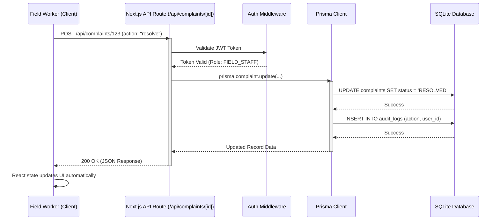

# NagarMitra - Architecture Document

This document outlines the high-level architecture, data flow, and technology choices for the **NagarMitra** (Municipal Portal) application.

---

## 1. Technology Choices and Rationale

| Technology | Role | Why it was chosen |
| :--- | :--- | :--- |
| **Next.js 16 (App Router)** | Full-Stack Framework | Provides a unified environment for both the frontend React UI and backend API routes. The App Router enables advanced server-side rendering, which improves performance and SEO. |
| **TypeScript** | Programming Language | Adds strict static typing to JavaScript. This drastically reduces runtime errors, improves code autocomplete in the editor, and ensures that the data contracts between the database and the UI remain strictly enforced. |
| **Tailwind CSS 4** | Styling & UI | A utility-first CSS framework that allows for rapid, consistent UI development. It makes building responsive layouts (mobile & desktop) exceptionally fast without writing custom CSS files. |
| **Prisma ORM** | Database Access | A next-generation Object-Relational Mapper. Prisma provides a type-safe database client, making database queries predictable and heavily reducing SQL injection risks. It also handles schema migrations gracefully. |
| **SQLite** | Database Engine | A lightweight, file-based relational database. Chosen because it requires absolutely zero configuration or external servers to run, making local development and immediate testing frictionless. |
| **JWT & bcrypt** | Security & Auth | `bcrypt` is used to securely hash user passwords before storing them in the database. JWT (JSON Web Tokens) are used to securely maintain user sessions without needing heavy server-side session storage. |
| **Vercel** | Hosting & Deployment | The creators of Next.js provide the best, zero-config hosting environment for Next.js applications, enabling automatic builds and global edge-network distribution. |

---

## 2. High-Level Components

The application is broken down into three primary layers:

1. **Client / Presentation Layer (Frontend)**
   - **Pages (`src/app/**/page.tsx`)**: The UI views presented to the users (e.g., Dashboard, New Complaint Form, Complaint Details).
   - **Components (`src/components/`)**: Reusable UI elements (e.g., Layout headers, status badges, buttons).
   - *Responsibility*: Capturing user inputs, rendering data, and handling client-side routing.

2. **API Layer (Backend Controllers)**
   - **API Routes (`src/app/api/**/route.ts`)**: RESTful endpoints that handle specific business logic.
   - *Responsibility*: Authenticating requests, validating incoming data payloads, and acting as the middleman between the client and the database.

3. **Data Access Layer (Database)**
   - **Prisma Client (`src/lib/prisma.ts`)**: The singleton instance that connects to the database.
   - **Schema (`prisma/schema.prisma`)**: Defines the tables (`User`, `Complaint`, `Department`, `Category`, `AuditLog`).
   - *Responsibility*: Executing CRUD (Create, Read, Update, Delete) operations safely on the SQLite database file (`dev.db`).

---

## 3. Data Flow Diagram

The following illustrates how data moves through the system during a standard operation (e.g., a Field Worker submitting resolution evidence).

---

## 4. Security & Role-Based Access Control (RBAC)

The application implements a strict RBAC system at the API level.

- **Authentication**: Users must provide valid credentials to receive a JWT. This JWT is sent with every subsequent API request.
- **Authorization**: The API routes explicitly check the `role` embedded in the JWT before performing actions:
  - *Citizens* can only view and update their *own* complaints.
  - *Receiving Officers* can view newly submitted unassigned complaints.
  - *Department Heads* can assign workers and view complaints belonging to their specific department.
  - *Field Staff* can only update complaints specifically assigned to them.
  - *Admins* bypass all restrictions and have global read/write access.
