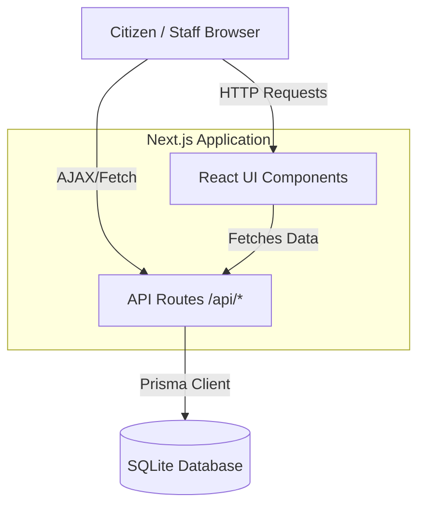

# Architecture Document

## 1. System Overview
MuniPortal is a comprehensive Public Grievance Management System designed to connect citizens with their local municipal authorities. It allows citizens to report civic issues (like potholes, streetlights, or waste management), track their resolution, and enables corporation staff to efficiently manage and assign these issues to field personnel.

## 2. Technology Stack & Rationale
- **Framework:** Next.js (App Router). *Why?* It provides a unified full-stack environment. We can build React server and client components alongside our backend API routes in a single repository, significantly accelerating MVP development.
- **Styling:** Tailwind CSS & Custom UI components (Lucide React for icons). *Why?* Utility-first CSS allows for rapid iteration and a highly polished, modern aesthetic without writing bulky external stylesheets.
- **Database ORM:** Prisma. *Why?* It offers an intuitive, type-safe schema definition and query builder. It handles migrations and client generation automatically.
- **Database Engine:** SQLite (local). *Why?* For a lightweight MVP, SQLite eliminates the need to provision and host a separate database server (like PostgreSQL), while still fully simulating relational data structures.

## 3. High-Level Component Architecture

## 4. Data Flow
1. **Authentication:** Users register/login via `/api/auth/*`. A JWT token is issued and stored in `localStorage`.
2. **Creation:** A citizen submits a complaint via the React UI, sending a POST request to `/api/complaints` with the JWT in the Authorization header.
3. **Storage:** The API route validates the input, generates a unique complaint ID (e.g., `CMP-2026-0001`), and uses Prisma to write to the `Complaint` table.
4. **Retrieval:** Corporation staff (depending on their Role and Department) fetch filtered lists of complaints from `GET /api/complaints`.
5. **Modification:** State transitions (e.g., assigning a staff member, marking as complete) are handled by `PATCH /api/complaints/[id]`, which verifies the user's role and authorization before updating the database.
